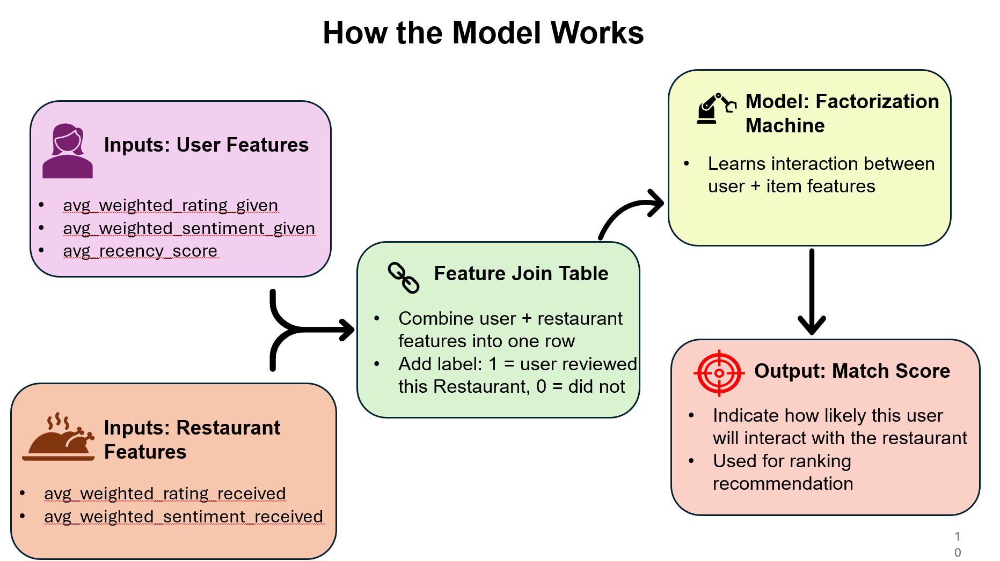

# 🍽️ Patterns Not Found: A Case Study in Yelp Chicago Restaurant Recommendations

> A real-world exploration of the limits of personalization in sparse review data  
> Team: Sarthak Dhanke, Connor Yeh, Fred Montero, Sahil Bharwani  
> Date: May 2025

---

## 📌 Project Summary

Most recommendation systems today optimize for accuracy — but what happens when your data doesn't support personalization in the first place?

This project investigates that question using real Yelp restaurant data in Chicago. We built and evaluated multiple recommender systems — hybrid models, graph neural networks, and traditional collaborative filtering — and found that extreme data sparsity limited all of them.

---

## 🧭 Problem Framing

> “We wanted recommendations that reflect **who you are**, not just **what’s popular nearby**.”

We aimed to build a model that uses both user behavior and restaurant attributes to recommend personalized dining options.

But very early in the process, we discovered that:
- **83.5% of users had written only 1 review**
- **Most restaurants had no more than 3 reviews**
- Matrix factorization, graph models, and hybrid architectures all broke in the same way

---

## 📥 Data Collection

We collected restaurant and review data from the Yelp API for the city of Chicago.  
Data included:
- 9,493 unique users
- 4,266 restaurants
- 13,931 user–restaurant review interactions
- Metadata such as star rating, review text, timestamp, categories, price, location, etc.

---

## 📊 Data Challenges

Extreme sparsity in both users and restaurants:

- **83.55%** of users wrote **only one review**
- **~90%** of restaurants had fewer than **3 reviews**
- Most matrix cells (user–restaurant pairs) were empty

This sparsity made both collaborative filtering and feature-driven ranking highly unstable.

---

## 🔧 Feature Engineering

We engineered aggregated features to represent user behavior and restaurant reputation:

| Feature | Description |
|---------|-------------|
| `avg_weighted_rating_given` | User’s generosity across past reviews |
| `avg_recency_score` | Time since last review |
| `avg_weighted_sentiment_given` | User’s review sentiment |
| `avg_weighted_rating_received` | Restaurant’s average rating (adjusted) |
| `normalized_log_review_count` | Trust signal (more reviews = higher stability) |

---

## 📐 Metrics That Reflect What Matters

We focused on **Precision@k** and **Recall@k** as our core metrics:

| Metric | What It Measures | Why It Matters |
|--------|------------------|----------------|
| `Precision@k` | How many of the top-k recommendations were actually correct | Reflects **user satisfaction** |
| `Recall@k` | How many good options we successfully retrieved | Reflects **engagement & coverage** |

These directly align with business outcomes like trust, retention, and discoverability.

---

## 🤖 Model 1: Feature-Based Hybrid (Factorization Machine)

We built a hybrid recommender using LightFM (with user + item features):

- Trained on user-item pairs, with side features
- Evaluated using Precision@10 and Recall@10

**Results:**
- `Precision@10`: **0.0006**
- `Recall@10`: **0.0046**

🔎 The system simply recommended the **most frequently reviewed restaurants** — same for every user.

---

## 🧹 Data Cleaning and Chain Removal

To avoid popularity bias, we removed large chain restaurants (Subway, Starbucks, etc.).

But even after that, the system just shifted to **local chains with the most reviews** — still no personalization.

---

## 🔬 Explainability with SHAP

We applied SHAP on our hybrid model to understand what was driving predictions.

**Key Finding:**  
The system was almost entirely driven by `avg_weighted_rating_given` — the user’s generosity.  
Item-side features had **almost zero influence**.

> “This user rates everyone highly, so a high score doesn’t mean this place is especially relevant.”

---

## 🧠 Model 2: Graph Neural Network (GraphSAGE)

We also tried using GNNs to see if message passing could overcome the cold-start problem.

**Results:**
- `Precision@10`: **1.00**
- `Recall@10`: **0.006**
- AUC: **0.779**

💡 **What Happened?**
- The GNN **memorized** a few strong user–restaurant links
- But it couldn’t generalize — **most users had no overlapping neighbors**
- Message passing **collapsed under sparsity**

---

## 🧵 Summary of Results

| Method | Precision@10 | Recall@10 | Notes |
|--------|--------------|-----------|-------|
| Hybrid FM | 0.0006 | 0.0046 | Repeated popular restaurants |
| GNN | 1.00 | 0.006 | Memorized a few, failed to generalize |

---

## 🧩 Conclusion

> The limiting factor wasn’t the model — it was the **data**.

- Without user interaction history, no model can infer taste  
- Without review density, even restaurant features are statistically meaningless  
- Even the strongest models only surfaced what was **already known**  
- **Personalization failed** — because there was no signal to personalize

---

## 📌 Key Lessons

- **Model power ≠ outcome power** — GNNs and matrix factorization cannot solve cold-start alone
- **Always sanity-check the data first** — counts, density, signal
- **Don’t skip baselines** — if popularity dominates, personalization may be infeasible
- **Cold-start remains the hardest problem in recommender systems**

---

